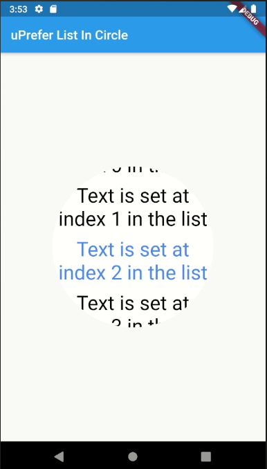

# ListInCircle


List in a circle, selection done by item position.

This widget display a listView in a circle and set item selected when this is in central zone of the circle.

 

## Installation

In your pubspec.yaml file, depencies, add following lines:
```yaml
  listincircle:
    git:
      url: https://gitlab.com/uprefer/listincircle.git
      ref: 1.2.1
```

Your dependencies section looks like:

```yaml
dependencies:
  flutter:
    sdk: flutter
  listincircle:
    git:
      url: https://gitlab.com/uprefer/listincircle.git
      ref: 1.2.1
  ...
```

In your project path, exec 
```bash
    flutter packages get
```
or use your favorite IDE to download dependencies.

## Deps

For Flutter ^1.7

ListInCircle use some dependencies:
- [rect_getter](https://pub.dev/packages/rect_getter)
- [auto_size_text](https://pub.dev/packages/auto_size_text)

## Usage

This library provide a unique Widget

You can use it like this:

```dart
class _MyHomePageState extends State<MyHomePage> {
  List<String> items = List<String>();


  @override
  void initState() {
    super.initState();

    for(var i = 0; i <= 111; i++){
      items.insert(i, i.toString());
    }
  }

  @override
  Widget build(BuildContext context) {
    return Scaffold(
      appBar: AppBar(
        title: Text(widget.title),
      ),
      body: Center(
        child: ListInCircleWidget(
          circleDiameter: 250,
          initialSelectedItemIndex: 0,
          itemCollection: items,
          onSelectionChanged: (index){
              // DO SOME ACTION
            print(index);
          },
        ),
      ),
    );
  }
}
```

## Parameters

| Parameter      | Type         | Default value |Description |
| -------------- |:------------:|:------------: |:-----------|
| circleDiameter | double       |  | Size of the circle diameter |
| itemCollection | List<String> |  | Items to display in the Widget |
| initialSelectedItemIndex | int      | 0    | Index of the default selected item at state initialization |
| circleColor | Color | Colors.white | Circle background color |
| defaultFontSize | double | circleDiameter / 4 | Default text font size (will be autmaticaly resized if needed)  |
| onSelectionChanged | Function |  | Closure executed when selection has been changed |
| onScrollEnded | Function | | Closure executed when scroll action ended |
| selectedTextStyle | TextStyle | TextStyle(color: Colors.blueAccent) | Selected item text style |
| unSelectedTextStyle | TextStyle | TextStyle(color: Colors.black) | Default unselected item text style |

# Contributors

- [Danaru](https://gitlab.com/Danaru)
